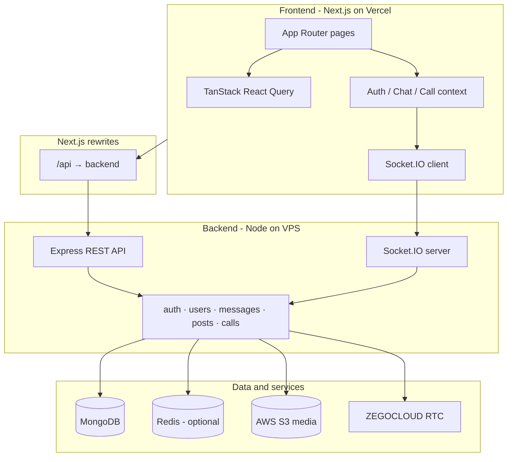

# Connectify — Frontend

> **About:** Web client for [Connectify](https://easy-connectify.vercel.app) — a full-stack WhatsApp-style app with real-time chat, social feed, friends, and audio calls. Built with **Next.js 15**, **React 19**, and **Socket.IO**. API: [connectify-backend](https://github.com/reazulislamreaz/connectify-backend).

**Full-stack real-time social messaging app** — 1:1 chat, social feed, friends, presence, voice notes, and audio calls. Production deployment on **Vercel** (frontend) + **VPS** (backend).


---

## At a glance (for recruiters)

| | |
|---|---|
| **What it is** | WhatsApp-style web app: messaging, news feed, friend graph, profiles, voice/video calls |
| **Live demo** | [easy-connectify.vercel.app](https://easy-connectify.vercel.app) |
| **API** | [easyconnectify.duckdns.org](https://easyconnectify.duckdns.org) |
| **Frontend repo** | [connectify-frontend](https://github.com/reazulislamreaz/connectify-frontend) (this repo) |
| **Backend repo** | [connectify-backend](https://github.com/reazulislamreaz/connectify-backend) |
| **Role** | End-to-end product: UI/UX, client state, real-time client, API integration, deployment |

**Skills demonstrated:** React 19, Next.js 15 App Router, TypeScript, TanStack Query, Socket.IO, responsive UI (Tailwind), JWT auth flows, infinite scroll, optimistic updates, WebRTC integration (ZEGOCLOUD), production env/proxy setup (Vercel + VPS).

---

## What users can do

- **Chat** — Real-time 1:1 messages (text, images, voice notes), replies, edit/delete, read receipts, typing indicators
- **Calls** — Audio calls with invite / accept / reject (ZEGOCLOUD WebRTC)
- **Feed** — Create posts with photos, like and comment, infinite scroll
- **Friends** — Discover users, send/accept/cancel requests, message friends
- **Profile** — Edit profile, avatar upload, online / last-seen presence
- **Layout** — Mobile-first navigation + desktop layout with sidebar and feed-style center column

---

## Architecture (full stack)



**How the pieces talk**

1. **REST** — Browser calls `/api/*`; Next.js proxies to the backend (no CORS pain in production).
2. **WebSockets** — After login, the client opens a Socket.IO connection with the JWT for live messages, typing, presence, and call signaling.
3. **Media** — Uploads go to the API; files are stored on **AWS S3**; URLs are served back to the UI.
4. **Calls** — Backend mints ZEGOCLOUD tokens; the frontend loads the WebRTC SDK only when a call starts.

---

## Repositories

| Repository | Stack | Responsibility |
|------------|-------|----------------|
| **This repo** | Next.js 15, React 19, Tailwind, React Query | UI, routing, client cache, sockets, call UI |
| **[connectify-backend](https://github.com/reazulislamreaz/connectify-backend)** | Node.js, Express, TypeScript, MongoDB, Socket.IO | Auth, business logic, persistence, real-time events, S3, call tokens |

Backend documentation (API modules, security, Redis scaling, AI roadmap):  
**[connectify-backend/README.md](https://github.com/reazulislamreaz/connectify-backend/blob/main/README.md)** · **[docs/API.md](https://github.com/reazulislamreaz/connectify-backend/blob/main/docs/API.md)**

---

## Tech stack

### Frontend (this repo)

| Layer | Technology |
|-------|------------|
| Framework | Next.js 15 (App Router) |
| UI | React 19, Tailwind CSS |
| Server state | TanStack React Query (infinite queries, cache invalidation) |
| Real-time | Socket.IO Client |
| Voice / video | ZEGOCLOUD WebRTC (dynamic import) |
| Deploy | Vercel |

### Backend ([connectify-backend](https://github.com/reazulislamreaz/connectify-backend))

| Layer | Technology |
|-------|------------|
| Runtime | Node.js 20+, TypeScript |
| HTTP | Express 4, Zod validation |
| Database | MongoDB (Mongoose) |
| Real-time | Socket.IO 4 (+ optional Redis adapter) |
| Cache | Redis (optional) |
| Storage | AWS S3 |
| Calls | ZEGOCLOUD server-side tokens |
| Deploy | VPS, nginx, PM2 |

---

## Live environment

| Service | URL |
|---------|-----|
| **Web app** | [https://easy-connectify.vercel.app](https://easy-connectify.vercel.app) |
| **API & WebSocket** | [https://easyconnectify.duckdns.org](https://easyconnectify.duckdns.org) |
| **Health check** | `GET https://easyconnectify.duckdns.org/health` |

---

## Local development

### Prerequisites

- Node.js 20+
- npm
- [connectify-backend](https://github.com/reazulislamreaz/connectify-backend) running locally (default port **8081**)

### Frontend

```bash
npm install
cp .env.example .env.local
npm run dev
```

Open [http://localhost:3000](http://localhost:3000).

### Backend (separate terminal)

```bash
git clone https://github.com/reazulislamreaz/connectify-backend.git
cd connectify-backend
npm install
cp .env.example .env
npm run dev
```

See the [backend README](https://github.com/reazulislamreaz/connectify-backend#getting-started) for MongoDB, S3, Redis, and ZEGOCLOUD setup.

### Frontend `.env.local` (local API)

```env
NEXT_PUBLIC_API_URL=/api
BACKEND_PROXY_URL=http://localhost:8081
NEXT_PUBLIC_SOCKET_URL=http://localhost:8081
NEXT_PUBLIC_UPLOADS_URL=http://localhost:8081
```

### Frontend `.env.local` (UI only — live API)

```env
NEXT_PUBLIC_API_URL=/api
BACKEND_PROXY_URL=https://easyconnectify.duckdns.org
NEXT_PUBLIC_SOCKET_URL=https://easyconnectify.duckdns.org
NEXT_PUBLIC_SOCKET_PATH=/socket.io
NEXT_PUBLIC_UPLOADS_URL=https://easyconnectify.duckdns.org
```

Restart the dev server after changing env vars.

---

## Environment variables (frontend)

| Variable | Description | Production example |
|----------|-------------|-------------------|
| `NEXT_PUBLIC_API_URL` | Browser API base (use `/api` for Next proxy) | `/api` |
| `BACKEND_PROXY_URL` | Server-side rewrite target | `https://easyconnectify.duckdns.org` |
| `NEXT_PUBLIC_SOCKET_URL` | Socket.IO origin | `https://easyconnectify.duckdns.org` |
| `NEXT_PUBLIC_SOCKET_PATH` | Socket path | `/socket.io` |
| `NEXT_PUBLIC_UPLOADS_URL` | Media base URL | `https://easyconnectify.duckdns.org` |

ZEGOCLOUD keys are configured on the **backend** only.

---

## Deployment

| Part | Platform | Notes |
|------|----------|--------|
| Frontend | Vercel | Set env vars above; redeploy after changes |
| Backend | VPS + nginx + PM2 | API and Socket.IO on same origin |
| Database | MongoDB | Atlas or self-hosted |
| Files | AWS S3 | Avatars, post images, chat media, voice |

Backend must allow the frontend origin:

```env
CLIENT_URL=http://localhost:3000,https://easy-connectify.vercel.app,https://easyconnectify.duckdns.org
```

---

## Frontend project structure

```
src/
├── app/              # Routes: login, chat, feed, friends, users, dashboard, settings
├── components/       # PostCard, ChatComposer, layouts, skeletons, modals
├── context/          # Auth, chat list + socket handlers, voice calls
├── hooks/            # React Query hooks (feed, messages, friends, …)
└── lib/              # API client, socket, prefetch, uploads URL helper
```

---

## API surface (backend summary)

| Area | REST prefix | Real-time (Socket.IO) |
|------|-------------|------------------------|
| Auth | `/api/auth` | — |
| Users & profiles | `/api/users` | Presence to friends |
| Friends | `/api/friend-requests` | — |
| Messages | `/api/messages` | `send_message`, typing, read receipts |
| Chats | `/api/chats` | Conversation list updates |
| Feed | `/api/posts` | — |
| Calls | `/api/calls` | Invite, accept, reject, end |

Full reference: [backend docs/API.md](https://github.com/reazulislamreaz/connectify-backend/blob/main/docs/API.md).

---

## Roadmap — AI features (planned)

On-demand AI via future backend `/api/ai/*` (not in production yet):

- Smart reply, translation, chat summaries  
- Content moderation, voice transcription  
- In-app assistant, semantic search  

Details: [backend README — AI roadmap](https://github.com/reazulislamreaz/connectify-backend#roadmap--ai-features-planned).

---

## Scripts

| Command | Description |
|---------|-------------|
| `npm run dev` | Development server |
| `npm run build` | Production build |
| `npm run start` | Run production build locally |
| `npm run lint` | ESLint |

---

## Troubleshooting

| Issue | Fix |
|-------|-----|
| **404 on API** (Vercel) | Set `BACKEND_PROXY_URL=https://easyconnectify.duckdns.org` and redeploy |
| **Socket not connecting** | Use `https://` for `NEXT_PUBLIC_SOCKET_URL`; add Vercel URL to backend `CLIENT_URL` |
| **HTTP socket on HTTPS site** | Use the production DuckDNS URL, not `http://localhost` |
| **Env not applied** | Restart `npm run dev` or redeploy on Vercel |

---

## License

Private project.
